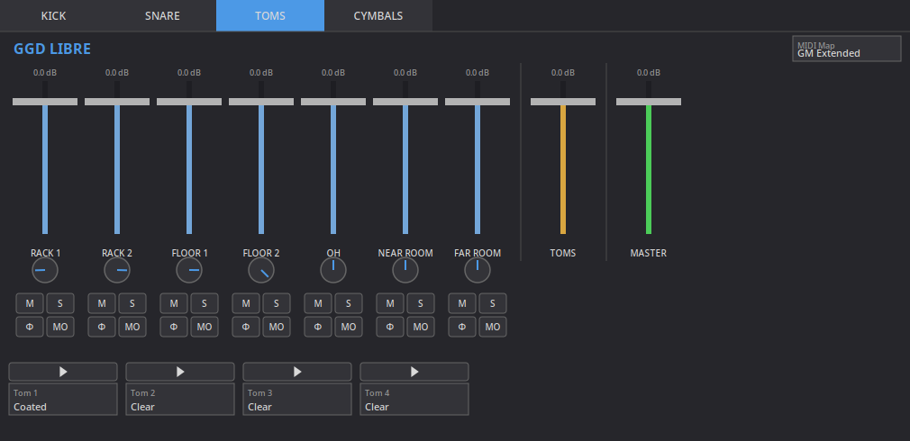

# ggd-libre

Reverse engineered CLAP Plugin that reimplements the GGD Kontakt drum plugin.



If like me you're interested in music production on Linux, you have likely already come across the massive challenge that is using Kontakt libraries through Wine. This project was built with the sole purpose of extracting the sample files from a legally purchased copy of GGD Matt Halpern Signature Pack and use it in a native plugin that runs on Linux and Windows.

ggd-libre has no affiliation to GGD and I do condone piracy of their products. This project simply exists as a way to use the plugin you paid for without relying on proprietary Kontakt bullshit and DRM.

Disclaimer, this project was entirely vibe coded as an experiment to gauge how well LLMs fare in reverse engineering tasks.

## Supported libraries

- GGD Matt Halpern Signature Pack
- GGD One Kit Wonder Metal
- GGD PV Matt Halpern Signature Pack

All three load in the same plugin. Pick one in the bar at the top of the
window; a library that isn't installed shows as "not extracted". Every kit
uses the same MIDI note layout, so a MIDI part plays on any of them.

## Installing

See [EXTRACTION.md](EXTRACTION.md) to turn your library into WAV files and a
`library_index.json`. Then put the libraries in a `ggd-libre-data` folder next
to the plugin, one subfolder per library:

```
<your CLAP folder>/
├── ggd-libre-linux.clap        (or ggd-libre-windows.clap)
└── ggd-libre-data/
    ├── halpern/
    │   ├── library_index.json
    │   └── wav/
    ├── okw_metal/
    │   ├── library_index.json
    │   └── wav/
    └── pv_halpern/
        ├── library_index.json
        └── wav/
```

The folder names must match exactly. You only need the libraries you own;
missing ones are greyed out in the plugin.

To keep the samples somewhere else, set `GGD_LIBRE_ROOT` to the folder that
holds `halpern/`, `okw_metal/` and `pv_halpern/`; it takes priority over
`ggd-libre-data`.

---
